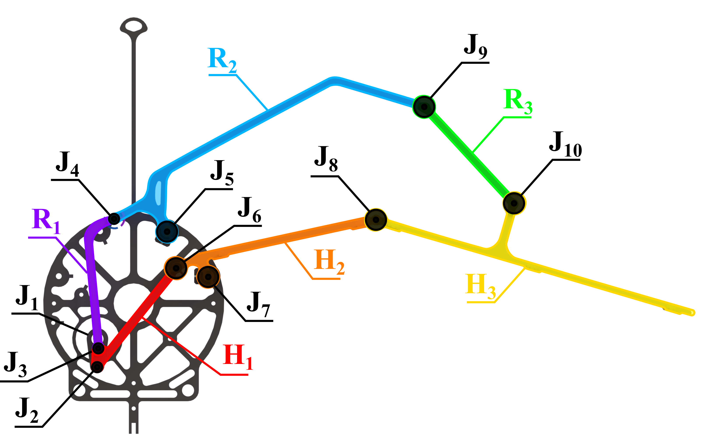
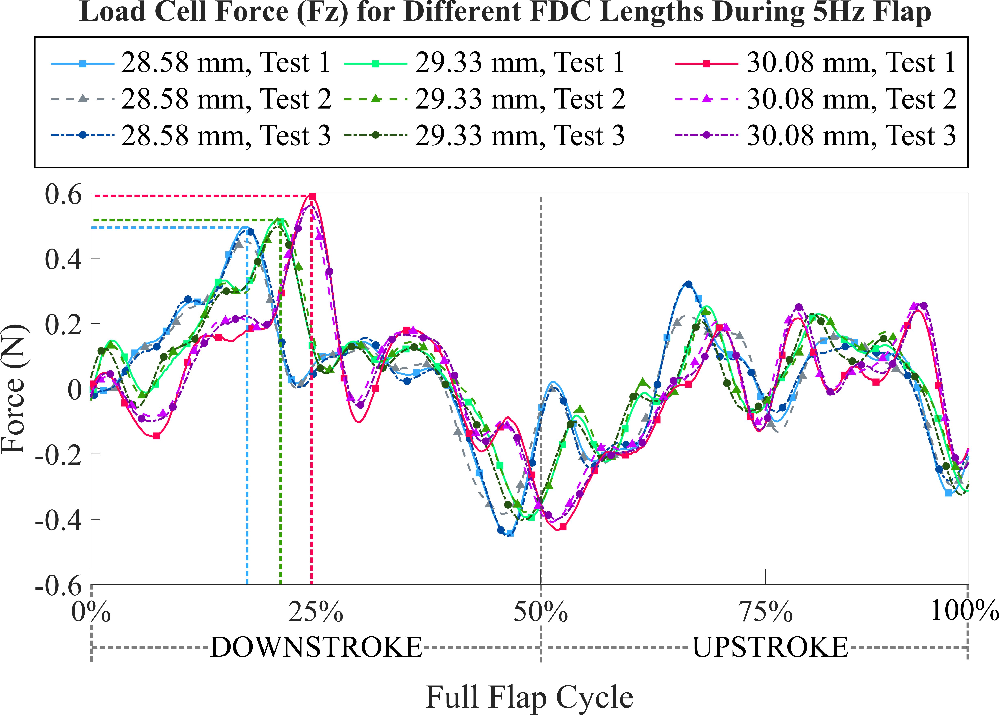
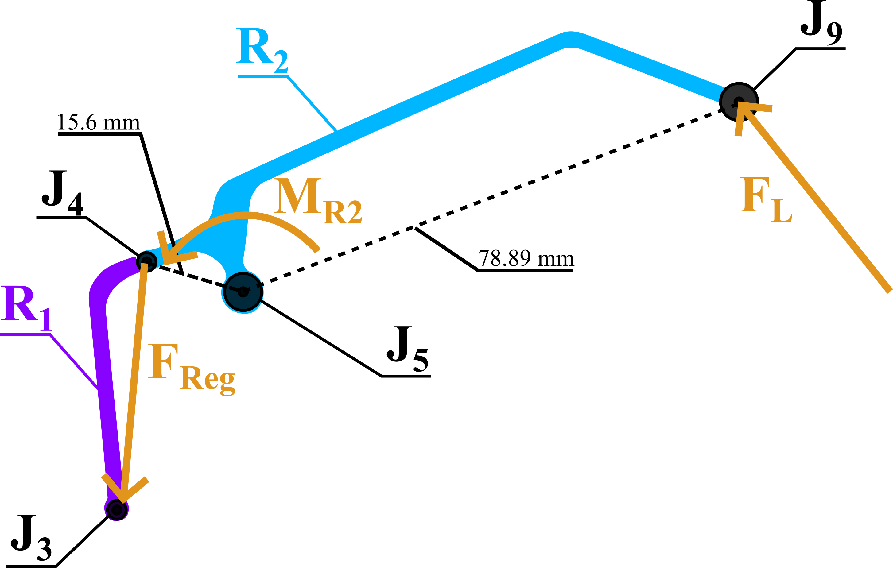
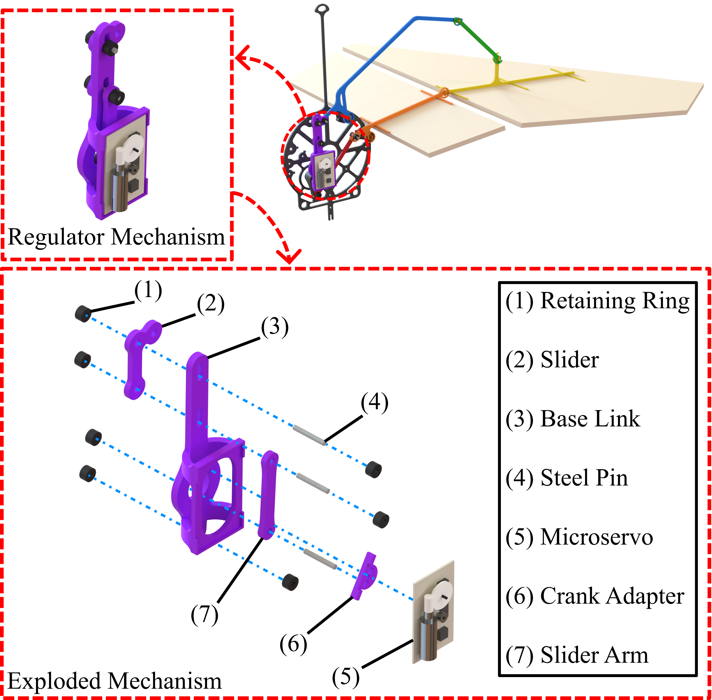
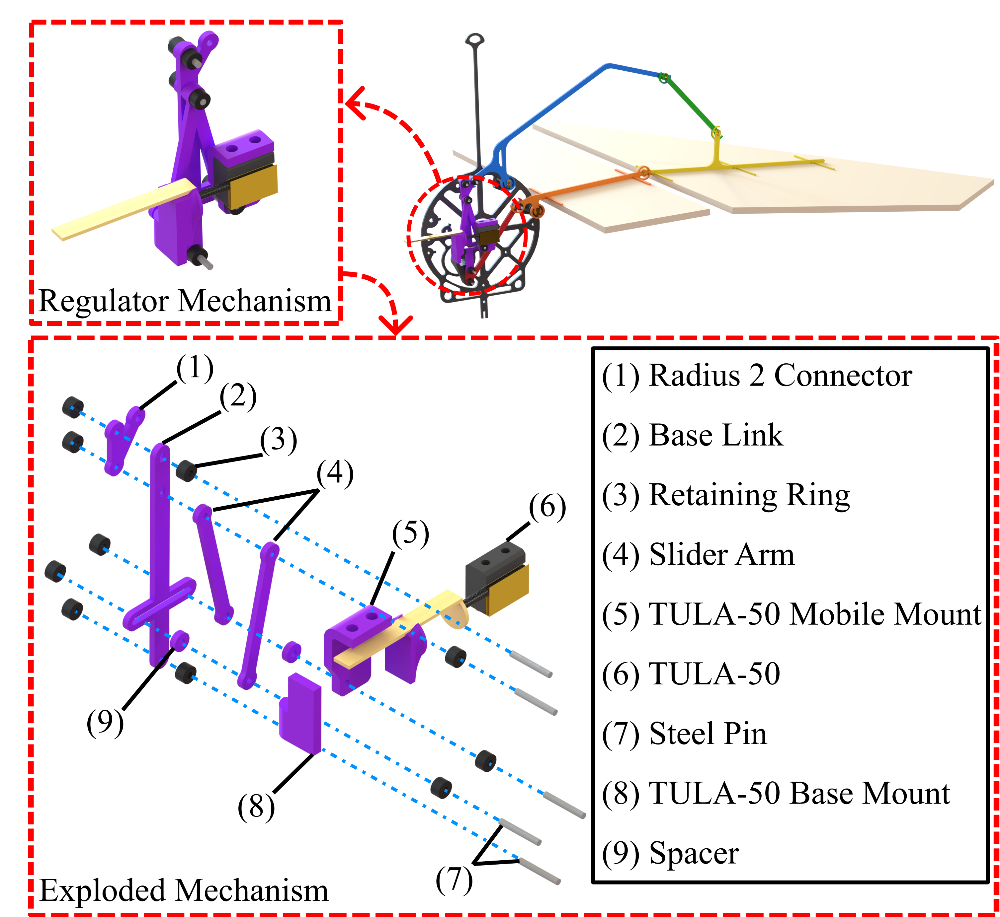
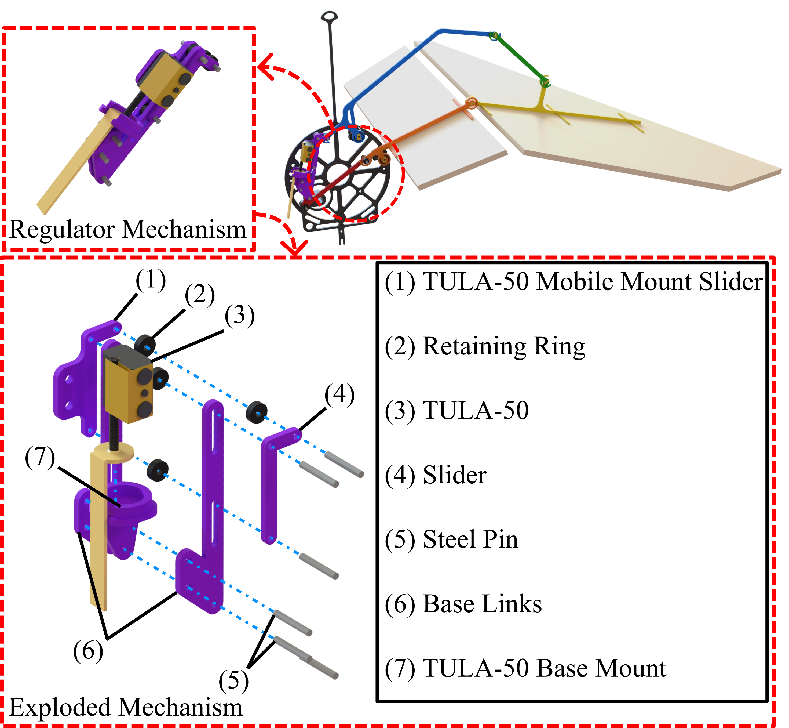
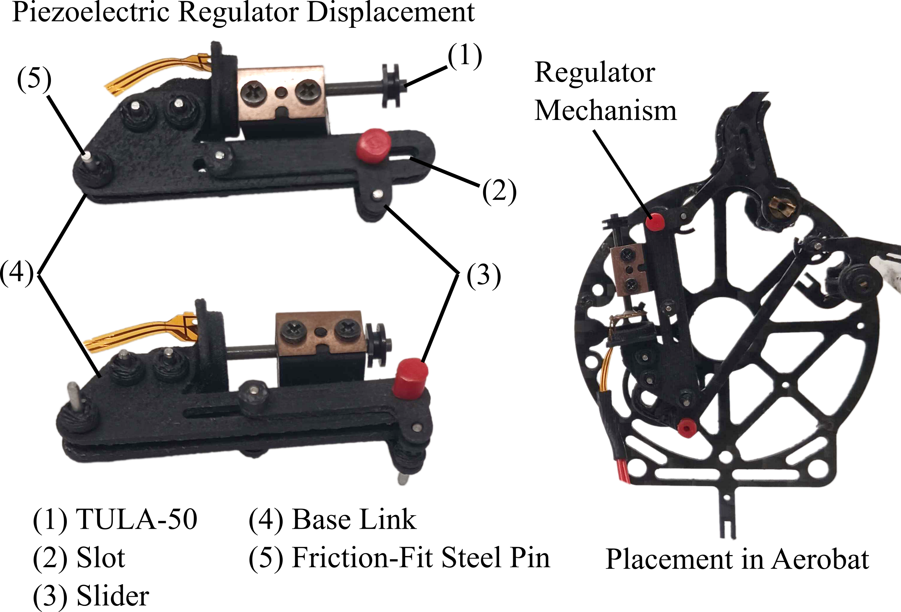

Aerobat is a flapping-wing robot developed by Dr. Alireza Ramezani and Dr. Eric Sihite in the Silicon Synapse Lab at Northeastern University. It features a bioinspired design based on bat physiology and utilizes a computational structure to drive a flapping gait with a single motor. Aerobat Delta is a prototype of the Aerobat platform that consists of only a single wing and an angular encoder on the shoulder joint for gait data collection and analysis.

I designed and prototyped a piezoelectric slip-stick actuated mechanism embedded in the wing linkage structure to alter the wingtip trajectory during flapping. This produced a differential thrust between each wing, allowing for roll authority. The following is a brief reproduction of the resulting thesis I completed for my Master's degree. It can be found at https://arxiv.org/pdf/2604.18900.

## Aerobat Delta Thrust Regulation

The design, fabrication, and testing of the integrated slip-stick actuated mechanism is the result of two years of research into the effect of wing linkage geometry on the flapping gait and thrust. The initial phase of this project was an experimental validation of the predicted thrust variation as a result of varying the length of link R1, as shown in the below figure.

This was done by mounting the Aerobat Delta platform to the end effector of a 6 Degree-Of-Freedom  (DOF) manipulator. The two were interfaced by a 6-DOF load cell and 3D-printed fixture. This setup relayed the produced thrust and torque in all 3 axes at a rate of 7kHz while the wings were actuated continuously. Three different lengths of link R1 were tested at three different flapping frequencies. The lift force produced in the vertical axis was isolated for a single wing flap of each length at each speed and compared. Across three trials of each combination of length and frequency, a trend was found. As shown in the below figure, the increase in R1 length resulted in a higher peak lift force and delayed timing within the individual flap. 

Based on the results of this experiment, a variable-length mechanism was to be integrated into the R1 linkage. The primary constraints on this mechanism were the weight and overall size of the mechanism. A core requirement was that the system fit entirely within the space occupied by the existing R1 link and minimize the total mass added to the robot. For these purposes, several actuation methods were considered. The two primary options considered were a small servomotor with a mass of 0.4 grams and a piezoelectric slip-stick actuator. 

Based on the geometry of the wing structure and estimated peak lift force produced per flap, the expected load on the R1 linkage was derived. The structure shown in the below figure was used as a basis for estimating the forces acting upon the linkage in question.

The first actuator used was the aforementioned servomotor. Using the rotational output shaft of the motor, a crank and slider mechanism was designed to produce the required linear displacement and force calculated. This was fabricated using FDM 3D-printing from carbon-fiber reinforced plastic. The components were fixed using steel pins and press-fit retaining rings.

This design was unsuccesful during testing, due to the poor manufacturing quality of the servomotors. The printed circuit boards used as the backplate of the motors had a tendency to delaminate under extremely low forces, and proved to be unusable. As a result, it was decided to abandon the use of the servomotors in favor of the piezoelectric slip-stick actuator.

The use of the piezoelectric actuator led to significant design changes in the mechanism. This was due to the linear motion output and lack of feedback control. Rather than use a crank and slider mechanism to convert a rotational output to linear movement, the linear motion of the piezoelectric actuator had to be manipulated directly. This required a system to produce a mechanical advantage in order to raise the output force of the acuator to the loading predicted previously. Two concepts for this mechanism were prototyped and tested. The first relied on a dual slider system, where the motion of the piezoelectric actuator drove a triangular linkage. This reduced the output range and magnified the force produced while changing the axis of motion by 90 degrees. This was fabricated in a similar manner to the previous servomotor-actuated iteration. The design of this prototype is shown below.

However, it was determined that the 3D-printed components produced a high amount of internal sliding friction. This prevented the mechanism from operating smoothly, and eventually stopped the piezoelectric actuator from moving. This led to the design of a second concept that reduced the number of moving components and produced a lower internal friction. This was at the expense of the mechanical advantage provided by the linkage structure. However, this was deemed suitable for testing as it was able to actuate the wing at low speeds. This final design is shown below.

This was fabricated with the same methods as the previous iterations, with the addition of further manual sanding of the internal surfaces. This both reduced the coefficient of friction of the base material and produced carbon dust that further lubricated the mechanism. This prototype is shown below, and was integrated into the Aerobat Delta structure.

This project was made possible by the Silicon Synapse Lab at Northeastern University, under the guidance of Dr. Alireza Ramezani. It could not have been done without my project mentor and fellow graduate student Bibek Gupta, or the other members of the Silicon Synapse Lab. The culmination of this research project is the thesis which I defended in April of 2026 as a requirement for my Master's of Science in Robotics, with a focus on Mechanical Engineering.