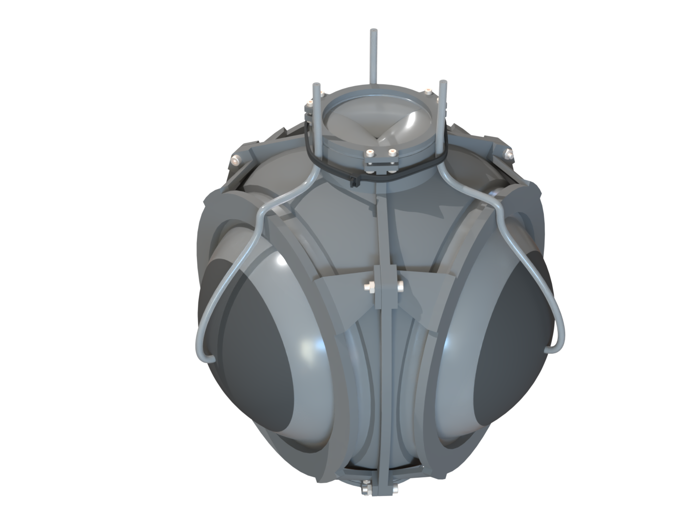
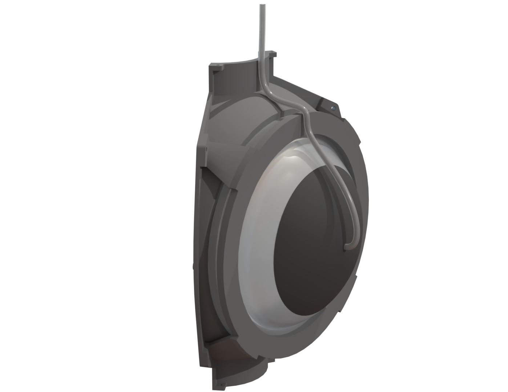
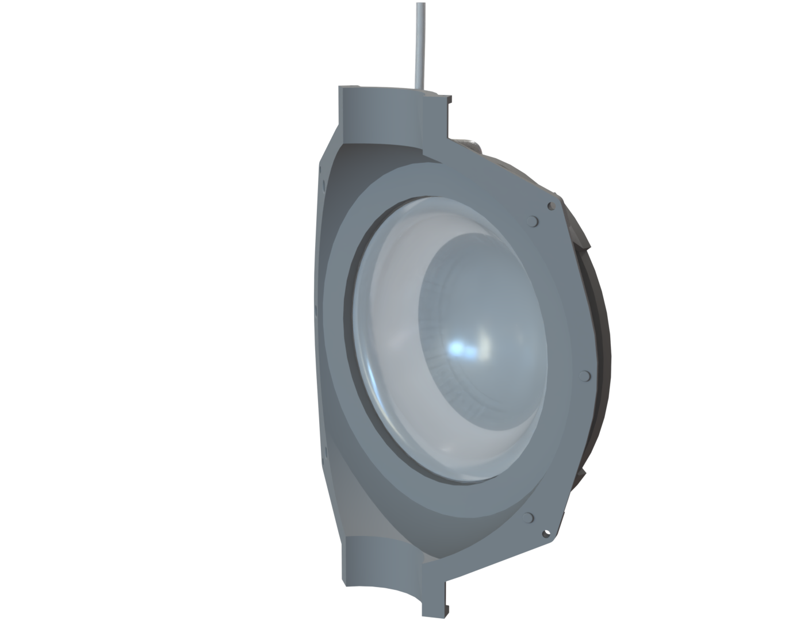
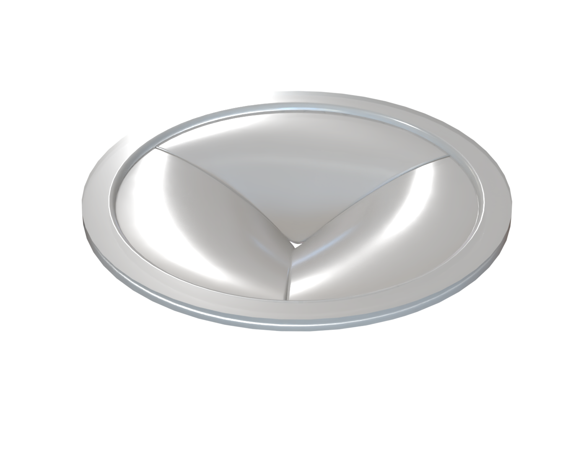
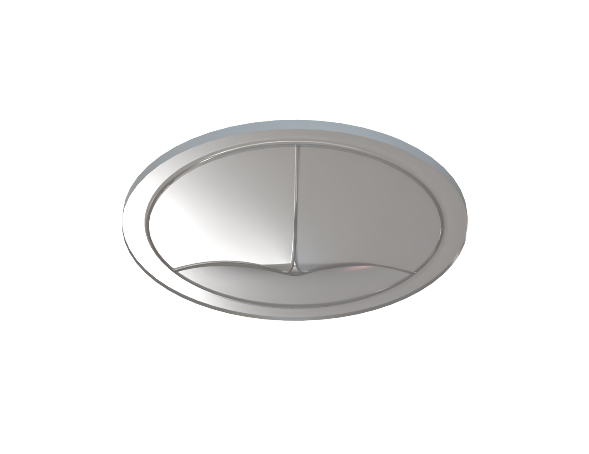

This is a research project I was responsible for in the Soft Machines and Electronics Lab at Case Western Reserve University, under Dr. Changyong Cao. This served as the undergraduate thesis for the completion of my Bachelor's degree. I designed and prototyped an aquatic propulsion system that utilized bistable shells to compress and expell water, and soft passive valves to direct the flow. This biomimetic design was based on the anatomy of cephalods, with inspiration from the biological jet propulsion that certain species utilize. I was fully responsible for all aspects of the project, from initial research and literature review to experimental validation and analysis. My primary research interest in my academic career has been biomimetic and bioinspired robotics and design.

## Biomimetic Aquatic Jet Propulsion

After installing and troubleshooting a pneumatic system in the Soft Machines and Electronics Lab, I proposed the design and testing of a pneumatically-driven aquatic robot. I was placed in charge of the project. During the initial literature review, a novel method of actuation was concieved. This was the use of bistable shells driven by pneumatic pressure. The hyperelastic behavior of the base material would allow for amplifying the force and motion produced by the pneumatic pressure, providing an ideal method for moving water through the jet structure. I based the initial concept on the natural jet-like structures found in cephalopods. These utilize musculature to compress a pocket, expelling water through a valve structure. The design of the robot actuated a similar pocket with the pneumatically-driven bistable shells, and included a set of soft passive valves to direct the flow. The same design philosophy was followed for the valve system, with the final design inspired by the valves found in the human heart. The tri-flap structure provided good theoretical flow while also sufficiently restricting backflow. 

The second phase of the project was the use of Finite Element Analysis (FEA) software to predict the performance of the bistable shells. This was done in ANSYS Mechanical. A custom hyperelastic material model was used to simulate the behavior of the silicone resin used in the project. By repeatedly iterating different design geometries, and altering the shell thickness, curvature, and lip shape, a configuration was found. This geometry produced the desired force and deformation with an input force that could be provided by the pneumatic pressure. The bistability of the shell geometry creates a "threshold" point in the deformation. When transitioning across this, the internal stresses and strains of the shell wall produce a rapid snapping to the other deformed state, either normal or inverted. This can be driven with relatively low speed and force, but produces a large amount of force when snapping. The deformation of the shell is shown in the video below.

<video width="640" height="360" controls>
  <source src="bistable_deformation_video.mp4" type="video/mp4">
  Your browser does not support the video tag.
</video>

The FEA model was then modified to include a pressurized air pocket within the wall geometry of the shell. This was closed from the outside by a shell of TPU plastic. The differential pressure inside the chamber altered the internal stress of the shell wall, causing a deformation that drove the shell over the bistable threshold and inverted it. The simulated pressure of the pneumatic pocket is shown below.

<video width="640" height="360" controls>
  <source src="bistable_deformation_video_alpha.mp4" type="video/mp4">
  Your browser does not support the video tag.
</video>

After a suitable geometric configuration of the bistable shell was reached, I created a full design for the propulsion system. Three shells were mounted in a rigid plastic frame in a ring, with the internal chamber enclosed providing enough volume for all three shells to compress inwards without contacting. This was capped on either end with a tri-flap valve, one allowing for water inflow and the other allowing only outflow. All three shells were driven by pneumatic tubes that connected to the TPU cap on the pressurized pockets, with the tubes secured to the exterior of the system and extending off to the pneumatic controllers. The entire structure was designed to be easily fabricated via 3D printing.

The jet system was comprised of three body panels. Each consisted of a rigid 3D printed struture with a bistable shell mounted through a hole in the side. A retaining ring was bolted on top of this, compressing the ring of the bistable shell and holding it in place. The pneumatic tube was mounted above this, with all three affixed via a plastic cable tie.

The tri-flap valve design is shown below. This was also designed to be fabricated from the silicone resin available. This would be casted in a 3D-printed mold. The jet system would layer this between the body panels of the structure and a retaining ring endcap.

This project was made possible by the Soft Machines and Electronics Lab at Case Western Reserve University, under the guidance of Dr. Changyong Cao.